# Telecom Client Billing & Management Web Application

<p align="center">
    <!-- Backend -->
  
  
  

  <!-- ORM / Database -->
  
  

  <!-- Frontend -->
  
  
  

  <!-- Other  -->
  
  
</p>


## Overview

This is a university project developed using **ASP.NET Core MVC**, **SQL Server**, and **Entity Framework Core**.  

It simulates a complete telecom billing service ecosystem with:

- Role-based interfaces (Admin, Seller, Client)

- Client management workflows

- Billing functionalities

- Program/Plan assignment and modification

- Session-based role handling

- Database-driven design using EF Core 9

Although designed for educational purposes, the project follows real-world application architecture practices (MVC, layered logic, DB normalization).

## Features

### 🔐 Authentication & Session
- Simple login system (username/password)
- Session-based role selection
- Three distinct user flows

### 👤 Client Features
- View billing history  
- View call history  
- Pay bills  

### 🧑‍💼 Seller Features
- Register new clients  
- Issue bills to clients  
- Assign/change client plans  
- Validate unique usernames & phone numbers  

### 👑 Administrator Features
- Create new sellers  
- Create & edit billing plans  
- Modify program rates, names, or assign permissions  

---

## Architecture

The project follows the **Model-View-Controller (MVC)** design pattern:

- **Models:** Represent entities like `User`, `Client`, `Seller`, `Bill`, `Call`, `Plan`, etc.
- **Views:** Razor pages organized by user role (Admin, Seller, Client)
- **Controllers:** Handle user input and business logic.
- **Database:** A structured relational schema handled via `MVCDBContext` using **Entity Framework Core**.

---

## ⚙️ Internal Architecture & Dependency Injection

The application uses ASP.NET Core’s **built‑in Dependency Injection (DI)** container.  
Key registered services in `Program.cs` include:

- `AddControllersWithViews()` — Enables MVC and Razor views  
- `AddDbContext<MVCDBContext>()` — Registers EF Core DbContext (SQL Server)  
- `AddSession()` — Enables session-based role and state handling  

These services are injected into controllers using constructor injection, keeping the architecture modular and testable.

---

## 🔧 ASP.NET Core Middleware Pipeline

The application uses the standard ASP.NET Core middleware pipeline, including:

- `UseHttpsRedirection()` — Enforces HTTPS  
- `UseStaticFiles()` — Serves static assets (CSS, JS, images)  
- `UseRouting()` — Enables endpoint routing  
- `UseAuthorization()` — Handles authorization middleware  
- `UseSession()` — Activates session state for logged‑in users  

---

## Technologies Used

- **ASP.NET Core MVC (.NET 8)**
- **C#**
- **Entity Framework Core 9**
- **Microsoft SQL Server 2022**
- **Razor Views**
- **Bootstrap 5**
- **HTML5 / CSS3**
- **Visual Studio 2022**

---

## Getting Started

1. Clone the repository:
   ```bash
   git clone https://github.com/kon-f/MVC_Telecom_Billing_Project
   ```

2. Open the solution in **Visual Studio 2022**.

3. Rename the configuration template:

   Rename `appsettings.Template.json` to `appsettings.json`.

   > On Linux/macOS, you can use:
   > ```bash
   > mv appsettings.Template.json appsettings.json
   > ```

   > On Windows, just rename the file manually or use PowerShell:
   > ```powershell
   > Rename-Item "appsettings.Template.json" "appsettings.json"
   > ```

4. Fill in your connection string in `appsettings.json`.

5. (Optional) Apply EF Core migrations:
   ```bash
   dotnet ef database update
   ```

6. Run the app.

---

## 📸 Screenshots

### 📊 Database Schema
<p align="center">
  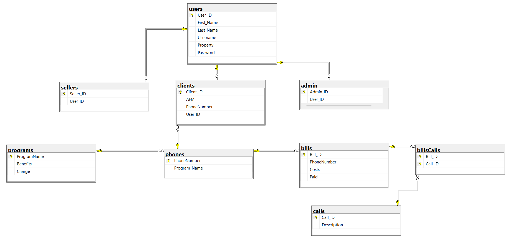
</p>

### 🔐 Authentication

<table>
<tr>
<td>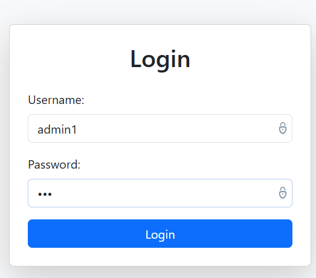</td>
<td>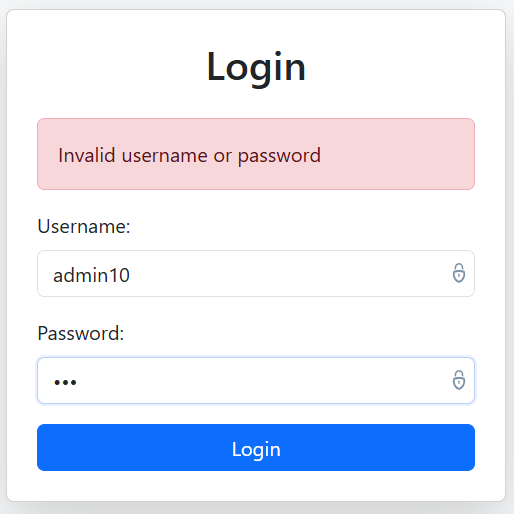</td>
</tr>
</table>

### 👑 Admin Dashboard & Seller Management

<p align="center">
  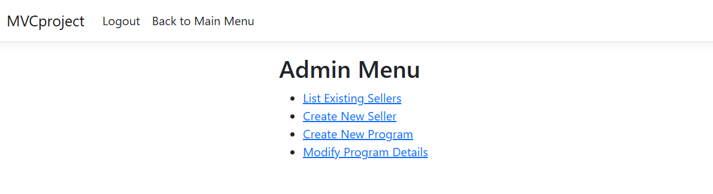
</p>

<table>
<tr>
<td>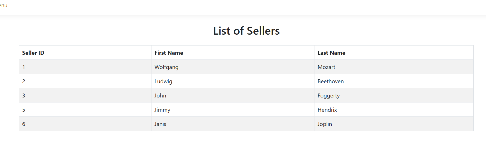</td>
<td>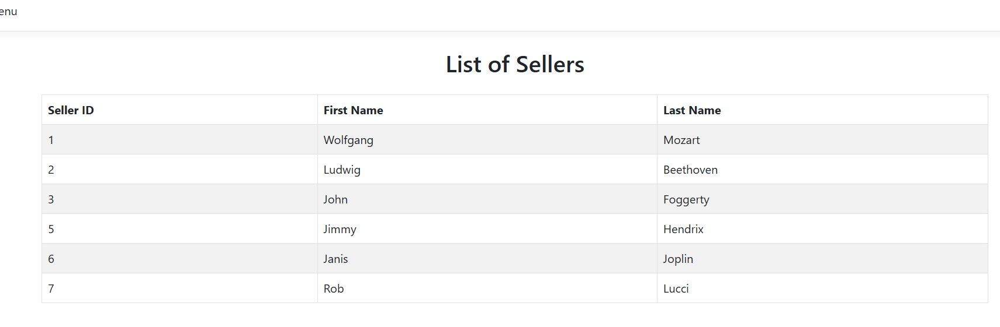</td>
</tr>
</table>

<table>
<tr>
<td>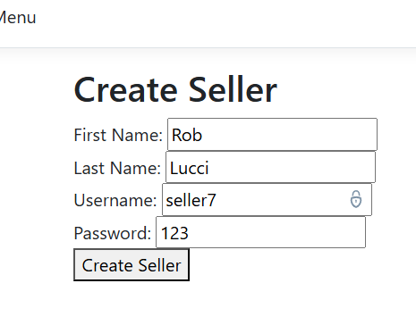</td>
<td>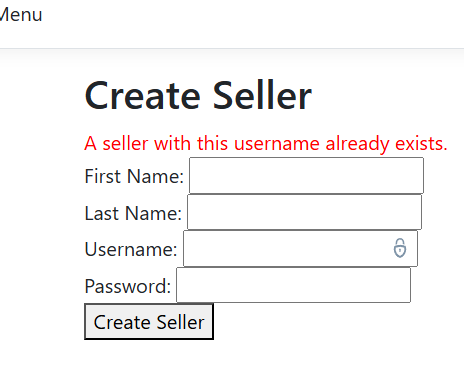</td>
</tr>
</table>

### 📝 Program Management (Admin)

<table>
<tr>
<td>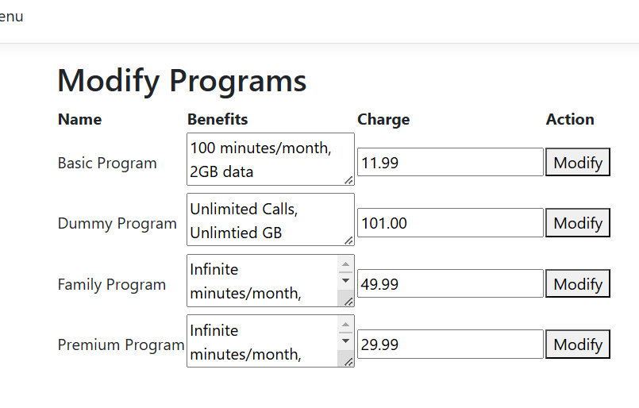</td>
<td>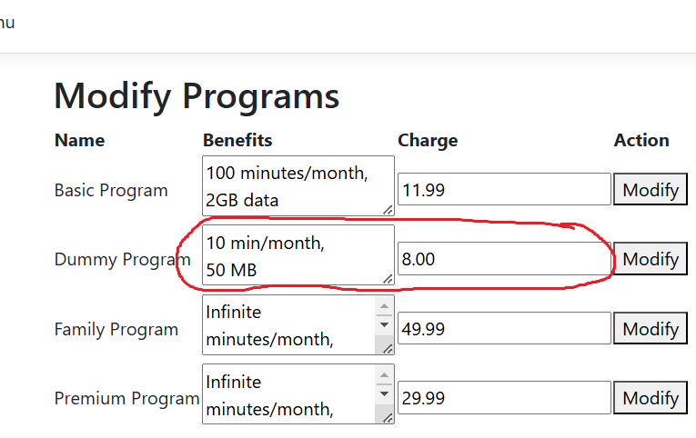</td>
</tr>
</table>

<table>
<tr>
<td>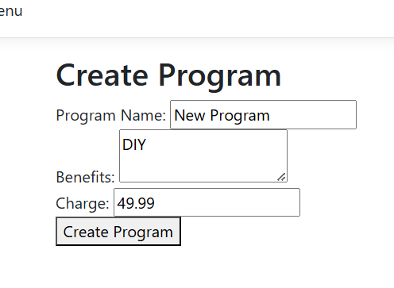</td>
<td></td>
</tr>
</table>

<p align="center">
  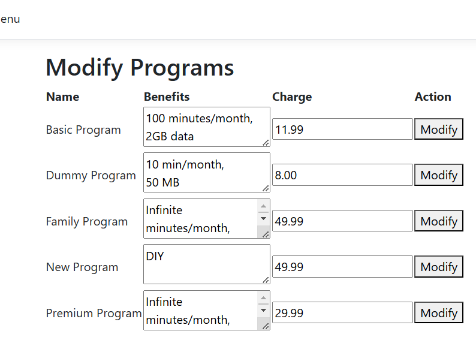
</p>

### 👤 Client Interface

<table>
<tr>
<td>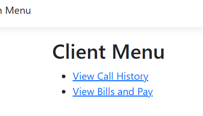</td>
<td>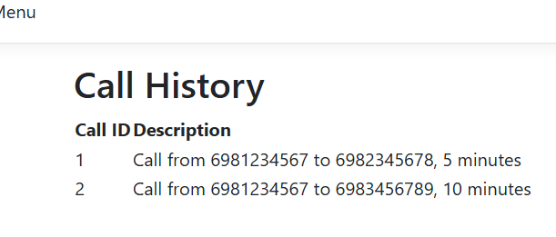</td>
</tr>
</table>

<table>
<tr>
<td>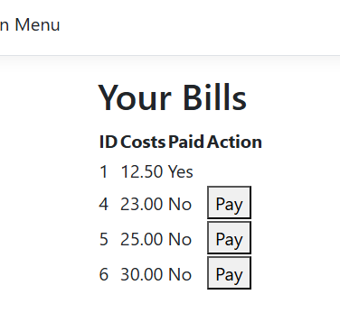</td>
<td>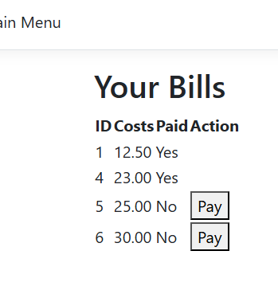</td>
</tr>
</table>

### 🧾 Seller Tools

<p align="center">
  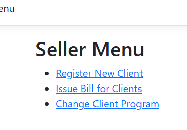
</p>

<table>
<tr>
<td>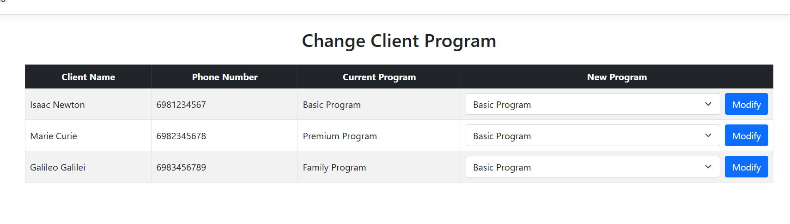</td>
<td>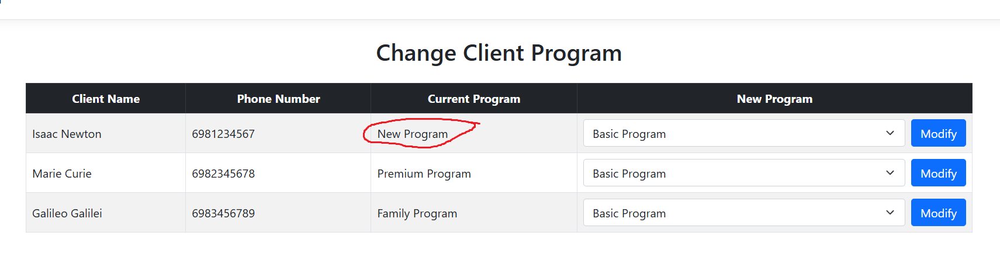</td>
</tr>
</table>

<table>
<tr>
<td>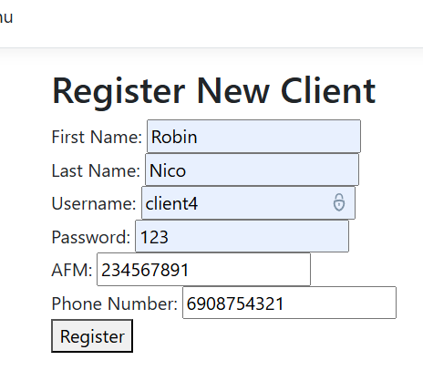</td>
<td>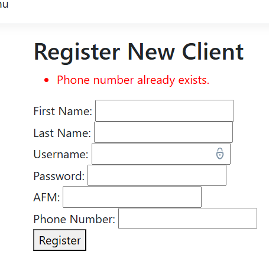</td>
</tr>
</table>

<table>
<tr>
<td>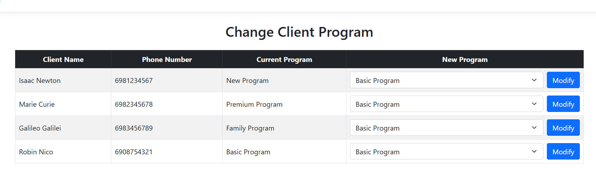</td>
<td>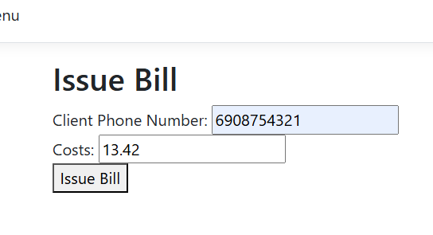</td>
</tr>
</table>

<table>
<tr>
<td>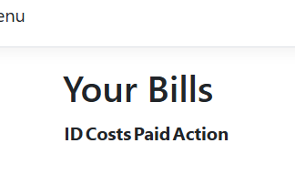</td>
<td>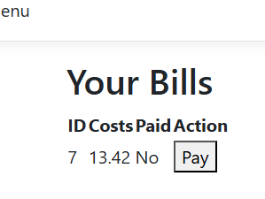</td>
</tr>
</table>
  
---

## Notes

- `appsettings.json` is excluded from version control.
- Project is for **educational purposes**; authentication is simplified.

---

## 📄 License

This project is licensed under the MIT License.  
You are free to use, modify, and distribute this software, provided that the original copyright notice and this permission notice are included.

See the **LICENSE** file for details.

