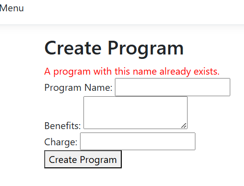

# Telecom Client Billing & Management Web Application

## Overview

This is a mid-course small university project developed using **ASP.NET Core MVC** and **SQL Server**. The application simulates a complete billing and client management system for a telecom service provider. It features role-based functionality for different types of users.

## Features

### 🔐 Login
- Basic login form for all users.
- Session/role management not fully implemented.

### 👤 Client
- View personal bills
- View call history
- Pay bills 

### 🧑‍💼 Seller
- Register new clients
- Issue client bills
- Assign clients to billing plans

### 🛠️ Administrator
- Create new sellers
- Create billing plans
- Modify billing plan details (e.g., flat rates)

## Architecture

The project follows the **Model-View-Controller (MVC)** design pattern:

- **Models:** Represent entities like `Client`, `Seller`, `Bill`, `Call`, `Plan`, etc.
- **Views:** Razor pages separated by user roles.
- **Controllers:** Handle user input and business logic.
- **Database:** Handled via `MVCDBContext` using **Entity Framework Core**.

## Technologies Used

- ASP.NET Core MVC
- C# (.NET 6 or later)
- Entity Framework Core
- Microsoft SQL Server 2022
- Visual Studio 2022

## Getting Started

1. Clone the repository:
   ```bash
   git clone https://github.com/your-username/your-repo-name.git
   ```

2. Open the solution in **Visual Studio 2022**.

3. Rename the configuration template:

   Rename `appsettings.Template.json` to `appsettings.json`.

   > On Linux/macOS, you can use:
   > ```bash
   > mv appsettings.Template.json appsettings.json
   > ```

   > On Windows, just rename the file manually or use PowerShell:
   > ```powershell
   > Rename-Item "appsettings.Template.json" "appsettings.json"
   > ```

4. Fill in your connection string in `appsettings.json`.

5. (Optional) Apply EF Core migrations:
   ```bash
   dotnet ef database update
   ```

6. Run the app.

## Screenshots

### Database Schema (Designed in Microsoft SQL Management Studio)


### 🔐 Login Page


### ❌ Failed Login


### 👑 Admin Logged In


### 📃 List Existing Sellers


### ➕ Create Seller


### ⚠️ Create Seller Fail


### ✅ Seller Created


### ⚙️ Modify Programs


### 📝 Modified Programs


### ➕ Create Program


### ❌ Create Program Fail


### 📋 View New Programs


### 👤 Client Menu


### 📞 Call History


### 📄 View Bills


### 💳 Pay Bill


### 🧾 Seller Menu


### 🔄 Change Client Program


### ✅ Client Program Changed


### ➕ Add Client


### ❌ Add Client Fail


### ✅ Client Added


### 🧾 Issue Bill


### 📭 No Bills Available


### 📬 Bills Available


## Notes

- `appsettings.json` is excluded from version control.
- The system is for educational purposes only and lacks full authentication/security handling.
